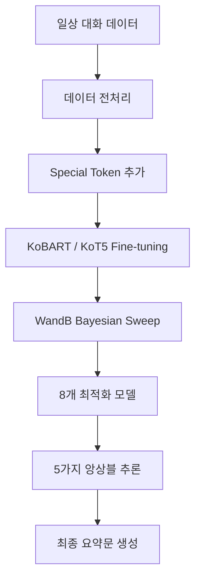

<div align="center">

<br>
<br>

# 📝 Dialogue Summarization

**KoBART/KoT5 기반 일상 대화 요약 시스템**

<br>

# 🏅 Tech Stack 🏅


</div>

<br>

## 👥 Team

|  |  |  |  |  |  |  |
| :--: | :--: | :--: | :--: | :--: | :--: | :--: |
| [문국현](https://github.com/GH-Door) | [류지헌](https://github.com/mahomi) | [이승현](https://github.com/shyio06) | [정재훈](https://github.com/coevol) | [조선미](https://github.com/LearnSphere-2025) | [이나경](https://github.com/imnaagyeong) | [이준석](https://github.com/Lee-0624) |
| 팀장 | 팀원 | 팀원 | 팀원 | 팀원 | 팀원 | 팀원 |

<br>

## Project Overview

| 항목 | 내용 |
|:-----|:-----|
| **📅 Date** | 2025.07 ~ 2025.08 |
| **👥 Type** | 팀 프로젝트 (Upstage AI Lab) |
| **🎯 Goal** | 일상 대화 요약 모델 개발 및 Multi-Model Ensemble을 통한 성능 최적화 |
| **🔧 Tech Stack** | PyTorch, Transformers, Hydra, WandB, KoBART, KoT5 |
| **📊 Dataset** | 일상 대화 요약 데이터셋 (Train 12,457 / Dev 499 / Test 250) |
| **🏆 Result** | **9팀 중 2위** (ROUGE-L 49.69 Mid / 46.54 Final) |

<br>

## 📋 목차

- [프로젝트 소개](#-프로젝트-소개)
- [시스템 아키텍처](#-시스템-아키텍처)
- [문제 해결 과정](#-문제-해결-과정)
- [프로젝트 구조](#-프로젝트-구조)

<br>

---

## 🎯 프로젝트 소개

일상 대화(학교, 직장, 쇼핑, 여행 등)를 자동으로 요약하는 NLP 모델 개발 프로젝트입니다. **KoBART** 및 **KoT5** 사전학습 모델을 Fine-tuning하고, **WandB Bayesian Sweep**으로 하이퍼파라미터를 최적화한 뒤, **5가지 앙상블 기법**을 비교하여 최종 **9팀 중 2위**를 달성했습니다.

### 핵심 특징
- 📝 **Multi-Model Ensemble**: 8개 모델 Logit Beam Search 앙상블로 리더보드 갱신
- ⚙️ **설정 중심 설계**: Hydra를 통한 실험별 config 관리
- 📊 **WandB Bayesian Sweep**: 자동 하이퍼파라미터 최적화 및 실험 추적
- 🔄 **5가지 앙상블 전략**: Hard Voting, Score-based, Length-based, Logit Beam Search, Logit Greedy

<br>

## 🏗️ 시스템 아키텍처



### Training & Inference Pipeline
```python
# Hydra 기반 설정 관리
@hydra.main(config_path="conf", config_name="config")
def main(cfg: DictConfig):
    model, tokenizer = load_tokenizer_and_model_for_train(cfg)
    trainer = load_trainer_for_train(cfg, model, tokenizer, train_dataset, val_dataset)
    trainer.train()
    output = inference(cfg)
```

<br>

## 🔧 문제 해결 과정

### 1️⃣ 단일 모델 Fine-tuning 성능 한계
> KoBART 단일 모델 Fine-tuning만으로는 ROUGE-L 48.04(Mid)에 그침. 대화체의 다양한 표현과 맥락을 하나의 모델로 충분히 학습하기 어려움

**해결:** **WandB Bayesian Sweep**으로 Learning Rate, Batch Size, Beam Search 등 핵심 파라미터를 자동 최적화하여 서로 다른 특성을 학습한 **8개 모델** 생성. 각 모델이 서로 다른 하이퍼파라미터 조합으로 대화 요약의 다양한 측면을 포착

---

### 2️⃣ 최적의 앙상블 전략 선정
> 여러 모델의 결과를 결합하는 방법에 따라 성능 차이가 크게 발생. Post-Generation 방식(Hard Voting, Score-based 등)과 Real-time 방식(Logit 기반) 간 비교 필요

**해결:** **5가지 앙상블 기법**을 체계적으로 구현 및 비교. **Logit Beam Search**(각 스텝에서 모든 모델의 확률 분포를 결합하여 상위 k개 빔 유지)가 ROUGE-avg 0.2969로 **1위** 달성, 기존 단일 모델 대비 유의미한 성능 향상 확인

---

### 3️⃣ 데이터 증강 효과 검증
> AEDA 기반 규칙적 데이터 증강(구두점 삽입, 유의어 교체 등)을 시도했으나 성능 향상 미미

**해결:** AEDA 2모델 앙상블(49.52 Mid)과 증강 없는 3모델 앙상블(49.69 Mid)을 비교하여, **단순 규칙 기반 증강보다 모델 다양성 확보가 더 효과적**임을 실험적으로 입증. 이후 모델 수 증가와 앙상블 전략 최적화에 집중

<br>

## 📁 프로젝트 구조

```
nlp_summarization/
├── main.py                        # 메인 진입점 (Hydra 기반)
├── conf/                          # 설정 파일
│   ├── config.yaml               # 메인 설정
│   ├── model/                    # 모델 설정
│   ├── data/                     # 데이터 설정
│   ├── training/                 # 학습 설정 (Epochs, LR, Scheduler 등)
│   └── inference/                # 추론 설정 (Beam Search, Max Length 등)
├── src/                           # 핵심 소스코드
│   ├── data.py                   # 데이터 로딩 및 전처리
│   ├── model.py                  # 모델 로드 (KoBART/KoT5)
│   ├── train.py                  # Seq2SeqTrainer 학습 로직
│   ├── inference.py              # 추론 파이프라인
│   ├── preprocess.py             # 텍스트 전처리
│   ├── utils.py                  # 로깅 유틸리티
│   └── check_gpu.py              # GPU 디바이스 확인
├── ensemble/                      # 앙상블 추론
│   ├── ensemble_inference.py     # 5가지 앙상블 기법 구현
│   └── ensemble_inference_best.py # 최적 앙상블 (리더보드 갱신)
├── sweep/                         # 하이퍼파라미터 최적화
│   ├── wandb_sweep.py            # WandB Bayesian Sweep
│   └── solar_api_sweep.py        # Solar API 파라미터 Sweep
├── augmentation/                  # 데이터 증강
│   ├── aeda_augmentation.py      # AEDA 증강
│   └── data_augmentation.py      # 범용 데이터 증강
├── notebooks/                     # 분석 노트북
│   ├── EDA.ipynb                 # 탐색적 데이터 분석
│   └── eda_preprocessing.ipynb   # 전처리 분석
├── data/                          # 데이터셋
└── pyproject.toml                 # 프로젝트 설정
```

<br>

## 📝 License

This project is licensed under the MIT License.

---

<div align="center">

**📝 Dialogue Summarization**
*Powered by KoBART & Multi-Model Ensemble*

[](https://opensource.org/licenses/MIT)
[](https://www.python.org/downloads/)
[](https://pytorch.org/)

Made with 📝 by NLP Summarization Team

</div>

---
